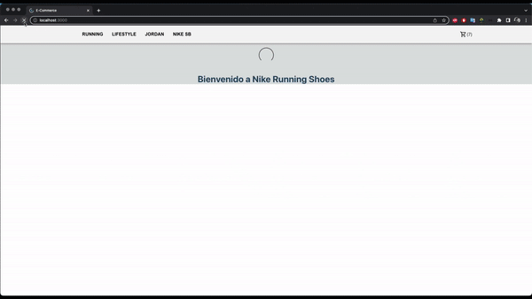

# Nike Shoes

Está es una página de venta de todo tipo de zapatillas de marca Nike.

La página cuenta con:

-Saludo de Bienvenida
-Vista general de todos los productos, donde cada tarjeta muestra una fotografía, el precio, la categoría y un botón “ver más” para conocer más información del producto
-En el NAVBAR se ubica el logo, las categorías de zapatillas y el icono del carrito
-Filtro por categorías de zapatillas. Desde el NAVBAR se puede acceder a la categoría de zapatillas deseada: Running, Lifestyle, Jordan y Nike SB
-Vista del detalle del producto: contiene el nombre del item, , una foto en tamaño más grande, una breve descripción, el precio, el stock, los respectivos botones para contabilizar la cantidad a comprar y el botón “comprar ahora” para realizar la compra
 

## Instalación

1. Cloná el repositorio

2. Parado en la raíz del proyecto corré el comando 

   ```
   npm install
   ```

    para instalar todas las dependecias del proyecto

3. Usá 

   ```
   npm start
   ```

    para correr el proyecto, que estará disponible en http://localhost:3000


## Dependencias

Uso de React Router Dom para la navegación.
Uso de la libreria Material UI para el estilo.

## Gift de Muestra




### Autor

Ramiro Barbagelata

2022 - Curso de React en CoderHouse